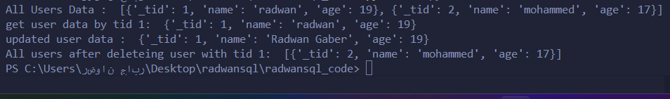

# RadwanSQL
this is a simple SQL db which i built it for fun, the core for RadwanSQL is Binary Search Tree (BST)

## Installation

```

```

## Main Parts of RadwanSQL : 
- **core.py   :** the implementation of binary search tree
- **fields.py :** the supported fields for db
- **table.py  :** the table manager of db


### Simple Implementation and usage of RadwanSQL
```python
# import libs
from radwansql import table, fields

class User (table.Table):
    fields = {
        'name' : fields.StringField(), # create string field 
        'age' : fields.IntegerField(), # create age field
    }

# User Instance
user = User()

# change db name from defualt to mydb
user.update_db_name('mydb')

# # Creating Users
user.create(
    name="radwan",
    age=19
)

user.create(
    name='mohammed',
    age=17
)


# Getting All User Data
users = user.all()
print("All Users Data : " ,users)

# get user by tid
my_user = user.get(1)
print("get user data by tid 1: ", my_user.data)

# update user
my_user = my_user.update(
    name="Radwan Gaber",
)

# Print Updated User Data
print("updated user data : ", my_user.data)

# delete my user
user.get(1).delete()

# fetch all users
print("All users after deleteing user with tid 1: ", user.all())

```

## Output



## NOTE:
**This db is created for educational purposes and for fun,And you cannot use it in real-life projects.**